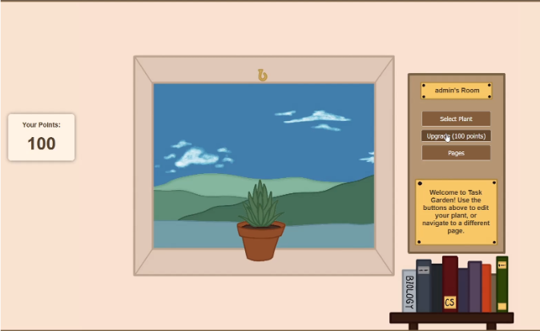

<!-- Improved compatibility of back to top link: See: https://github.com/othneildrew/Best-README-Template/pull/73 -->
<a name="readme-top"></a>


<!-- PROJECT SHIELDS -->
<!--
*** I'm using markdown "reference style" links for readability.
*** Reference links are enclosed in brackets [ ] instead of parentheses ( ).
*** See the bottom of this document for the declaration of the reference variables
*** for contributors-url, forks-url, etc. This is an optional, concise syntax you may use.
*** https://www.markdownguide.org/basic-syntax/#reference-style-links
-->
[![Contributors][contributors-shield]][contributors-url]
[![Forks][forks-shield]][forks-url]
[![Stargazers][stars-shield]][stars-url]
[![Issues][issues-shield]][issues-url]
[![MIT License][license-shield]][license-url]


<!-- PROJECT LOGO -->
<br />
<div align="center">
  <a href="https://github.com/WVU-CS230-2024-01-Group10/TaskGarden">
    
  </a>

<h3 align="center">project_title</h3>

  <p align="center">
    project_description
    <br />
    <a href="https://taskgarden-8c627.web.app/"><strong>Explore the live website »</strong></a>
    <br />
    <br />
    <a href="https://drive.google.com/file/d/1QPTxCjyH8sgWSYvWMUw-al4gc6xIgzPo/view?usp=sharing">View Demo</a>
    ·
    <a href="https://github.com/WVU-CS230-2024-01-Group10/TaskGarden/issues/new?labels=bug&template=bug-report---.md">Report Bug</a>
    ·
    <a href="https://github.com/WVU-CS230-2024-01-Group10/TaskGarden/issues/new?labels=enhancement&template=feature-request---.md">Request Feature</a>
  </p>
</div>


<!-- ABOUT THE PROJECT -->
## About The Project

<p align="center">
  
</p>


### Built With

* [![Node][Node.js]](https://nodejs.org/)
* [![React][React.js]][React-url]
* [![Firebase][Firebase.com]](https://firebase.google.com/)


<!-- Pages -->
## Pages

- [ ] Login: Access your plant
    - [ ] Register: Create an account
- [ ] Home: Main plant view
    - [ ] Profile: Select preferences
- [ ] Task: To-Do List

<!-- GETTING STARTED -->

### Prerequisites

Setting up the project locally
* npm
  ```sh
  npm install npm@latest -g
  ```

### Installation

1. Clone the repo
   ```sh
   git clone https://github.com/WVU-CS230-2024-01-Group10/TaskGarden.git
   ```
2. Install NPM packages
   ```sh
   npm install
   ```
3. Start the app
   ```sh
   npm start
   ```


<!-- USAGE EXAMPLES 
## Usage

Use this space to show useful examples of how a project can be used. Additional screenshots, code examples and demos work well in this space. You may also link to more resources.

_For more examples, please refer to the [Documentation](https://example.com)_
-->


<!-- LICENSE -->
## License

Distributed under the MIT License. See `LICENSE` for more information.


<!-- CONTACT 
## Contact

Your Name - [@twitter_handle](https://twitter.com/twitter_handle) - email@email_client.com

Project Link: [https://github.com/WVU-CS230-2024-01-Group10/TaskGarden](https://github.com/WVU-CS230-2024-01-Group10/TaskGarden)
-->


<!-- ACKNOWLEDGMENTS -->
## Acknowledgments
Daniel Campa, Elijah Hall, Christopher Jones, Gillian Breeden, Sandrik Tabidze

* [Daniel Campa](https://github.com/daniel-campa)
* [Elijah Hall](https://github.com/e-hall4)
* [Christopher Jones](https://github.com/caj00017)
* [Gillian Breeden](https://github.com/Gillian-Breeden)
* [Sandrik Tabidze](https://github.com/Sandrik)

<p align="right">(<a href="#readme-top">back to top</a>)</p>


<!-- MARKDOWN LINKS & IMAGES -->
<!-- https://www.markdownguide.org/basic-syntax/#reference-style-links -->
[contributors-shield]: https://img.shields.io/github/contributors/WVU-CS230-2024-01-Group10/TaskGarden.svg?style=for-the-badge
[contributors-url]: https://github.com/WVU-CS230-2024-01-Group10/TaskGarden/graphs/contributors
[forks-shield]: https://img.shields.io/github/forks/WVU-CS230-2024-01-Group10/TaskGarden.svg?style=for-the-badge
[forks-url]: https://github.com/WVU-CS230-2024-01-Group10/TaskGarden/network/members
[stars-shield]: https://img.shields.io/github/stars/WVU-CS230-2024-01-Group10/TaskGarden.svg?style=for-the-badge
[stars-url]: https://github.com/WVU-CS230-2024-01-Group10/TaskGarden/stargazers
[issues-shield]: https://img.shields.io/github/issues/WVU-CS230-2024-01-Group10/TaskGarden.svg?style=for-the-badge
[issues-url]: https://github.com/WVU-CS230-2024-01-Group10/TaskGarden/issues
[license-shield]: https://img.shields.io/github/license/WVU-CS230-2024-01-Group10/TaskGarden.svg?style=for-the-badge
[license-url]: https://github.com/WVU-CS230-2024-01-Group10/TaskGarden/blob/master/LICENSE
[linkedin-shield]: https://img.shields.io/badge/-LinkedIn-black.svg?style=for-the-badge&logo=linkedin&colorB=555
[linkedin-url]: https://linkedin.com/in/linkedin_username
[product-screenshot]: frontend/taskgardenapp/src/img/screenshot.png
[Node.js]: https://img.shields.io/badge/Node.js-43853D?style=for-the-badge&logo=node.js&logoColor=white
[Node-url]: https://nodejs.org/
[Firebase.com]: https://img.shields.io/badge/Google_Cloud-4285F4?style=for-the-badge&logo=google-cloud&logoColor=white
[React.js]: https://img.shields.io/badge/React-20232A?style=for-the-badge&logo=react&logoColor=61DAFB
[React-url]: https://reactjs.org/
[Bootstrap.com]: https://img.shields.io/badge/Bootstrap-563D7C?style=for-the-badge&logo=bootstrap&logoColor=white
[Bootstrap-url]: https://getbootstrap.com
